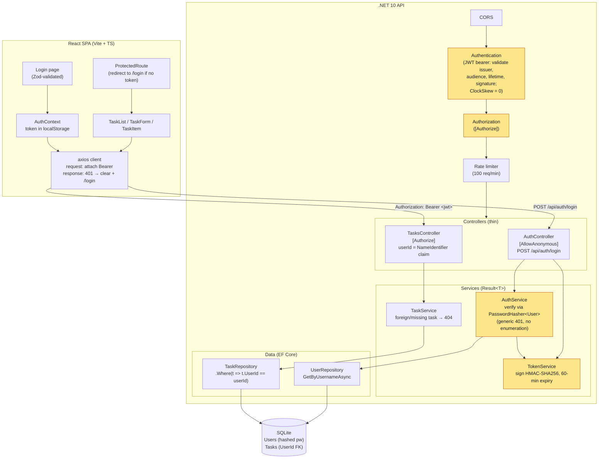
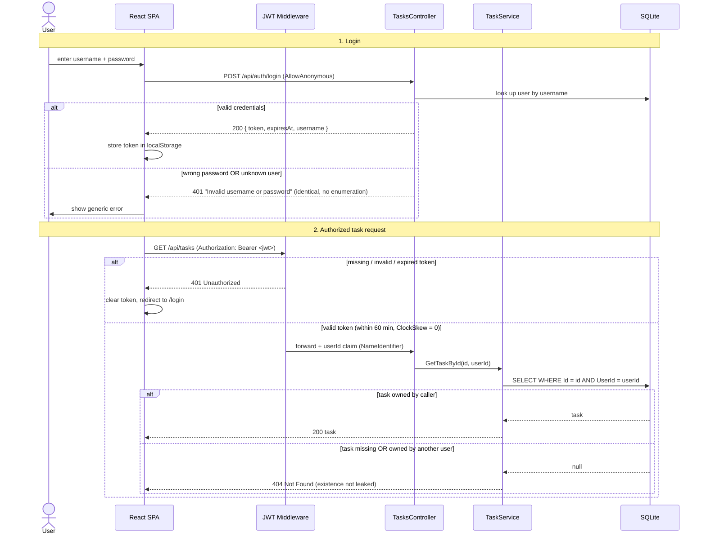

# Ezra Todo App

A production-ready task management application built as a full-stack take-home assessment. Demonstrates clean architecture, TDD, and production-grade engineering practices across a .NET 10 API and React frontend.

---

## Tech Stack

| Layer | Technology |
|-------|-----------|
| Backend | .NET 10 / ASP.NET Core |
| Database | SQLite + Entity Framework Core |
| Validation | FluentValidation (server) · Zod (client) |
| Logging | Serilog (file + console, daily rolling) |
| Testing (backend) | xUnit + Moq · WebApplicationFactory |
| Frontend | React 18 + TypeScript + Vite |
| Styling | Tailwind CSS (Editorial Precision design system) |
| State / data | TanStack Query (React Query) |
| Testing (frontend) | Vitest + React Testing Library |

---

## Quick Start

### Prerequisites

- **Node.js** v18+ (tested on v24)
- **.NET 10 SDK** — [download](https://dotnet.microsoft.com/download/dotnet/10.0)

Verify:
```bash
node --version      # v18+
dotnet --version    # 10.x.x
```

### 1 — Backend

```bash
cd backend

# Restore dependencies
dotnet restore

# Apply database migrations (creates todoapp.db)
dotnet ef database update --project TodoApi

# Start the API
dotnet run --project TodoApi
```

API runs at **http://localhost:5000**

### 2 — Frontend

```bash
cd frontend

# Install dependencies
npm install

# Start development server
npm run dev
```

App runs at **http://localhost:3000** and proxies `/api` to the backend.

---

## Running Tests

### Backend

```bash
cd backend

# Run all tests
dotnet test

# Run with coverage report (excludes auto-generated migrations)
dotnet test --collect:"XPlat Code Coverage" --settings coverlet.runsettings
```

Current coverage: **97.9% lines · 84.9% branches**

### Frontend

```bash
cd frontend

# Run tests (single pass)
npm run test -- --run

# Run with coverage
npm run coverage
```

Current coverage: **96.5% lines · 94.5% branches**

---

## Project Structure

```
ezra-todo/
├── backend/
│   ├── TodoApi/
│   │   ├── Controllers/        # HTTP layer — thin, delegates to services
│   │   ├── Services/           # Business logic, returns Result<T>
│   │   ├── Data/               # EF Core DbContext + repository
│   │   ├── Models/             # Domain entities (TodoTask)
│   │   ├── DTOs/               # Immutable request/response records
│   │   ├── Validators/         # FluentValidation validators
│   │   ├── Migrations/         # EF Core migration history
│   │   └── Program.cs          # App wiring (DI, middleware, CORS, rate limiting)
│   ├── TodoApi.Tests/
│   │   ├── Controllers/        # Integration tests (WebApplicationFactory + SQLite in-memory)
│   │   ├── Services/           # Unit tests (Moq)
│   │   ├── Data/               # Repository tests
│   │   └── Integration/        # End-to-end HTTP pipeline tests
│   └── coverlet.runsettings    # Coverage config (excludes migrations)
├── frontend/
│   └── src/
│       ├── components/         # TaskForm, TaskItem, TaskList
│       ├── hooks/              # useTasks, useCreateTask, useUpdateTask, useDeleteTask
│       ├── services/           # api.ts — typed fetch wrappers
│       ├── types/              # Task, TaskStatus, TaskPriority
│       └── test/               # Shared test utilities (renderWithProviders)
└── docs/
    ├── ADR-007-authentication-strategy.md
    ├── ADR-008-caching-strategy.md
    └── PRODUCTIONIZATION.md
```

---

## Architecture

### System architecture

The application is a React SPA talking to a layered .NET API over HTTP. Authentication is enforced by JWT bearer middleware, and every task query is scoped to the user identity carried in the token.



> Highlighted nodes are the security-critical components added by the JWT auth feature.

### Authentication & request flow

The sequence below traces the full lifecycle: login, an authorized request, and the three rejection paths (no/invalid token, expired token, another user's task).



---

## Authentication

### Login

The API uses JWT bearer tokens for authentication. All `/api/tasks` endpoints require a valid token obtained from the login endpoint.

**Login endpoint:**
```bash
POST http://localhost:5000/api/auth/login
Content-Type: application/json

{
  "username": "alice",
  "password": "Password123!"
}
```

**Response (200):**
```json
{
  "token": "eyJhbGciOiJIUzI1NiIsInR5cCI6IkpXVCJ9...",
  "expiresAt": "2026-06-15T11:45:00Z",
  "username": "alice"
}
```

**Seeded demo users:**
- Username: `alice` / Password: `Password123!`
- Username: `bob` / Password: `Password123!`

### Token Usage

Include the token in the `Authorization` header for all task operations:
```bash
curl -H "Authorization: Bearer <token>" http://localhost:5000/api/tasks
```

Tokens expire after **60 minutes**. On expiry (401 response), the frontend redirects to `/login`.

### Per-User Task Isolation

Each user only sees and can access their own tasks. Attempting to access another user's task returns **404** (not 403), a deliberate security choice to prevent leaking task existence. This means:
- `GET /api/tasks` returns only the authenticated user's tasks
- `GET /api/tasks/{id}` returns 404 if the task belongs to another user
- `PUT /api/tasks/{id}` returns 404 if the task belongs to another user
- `DELETE /api/tasks/{id}` returns 404 if the task belongs to another user

### Token Storage and Security Trade-offs

**Current implementation:** Tokens are stored in browser `localStorage`, making them accessible to JavaScript via XSS attacks if the application is compromised.

**Production migration path:**
1. Move token storage to **httpOnly cookies** (not accessible to JavaScript) with `Secure` and `SameSite=Strict` flags
2. Use a **BFF (Backend-For-Frontend) pattern**: the SPA communicates with a backend proxy that handles authentication and sets the httpOnly cookie, not the API directly
3. Store the JWT signing key in a **secrets manager** (AWS Secrets Manager, Azure Key Vault, etc.), not in configuration files

**Logout:** Currently client-side only — the frontend discards the token from localStorage. Production deployments should implement token revocation lists or short expiry + refresh token rotation.

---

## API Reference

Base URL: `http://localhost:5000/api`

| Method | Endpoint | Description | Auth | Success |
|--------|----------|-------------|------|---------|
| POST | `/auth/login` | Authenticate user, get JWT token | No | 200 / 401 |
| GET | `/tasks` | List all tasks (user's only) | Yes | 200 / 401 |
| GET | `/tasks?page=1&pageSize=20` | Paginated list (user's only) | Yes | 200 / 401 |
| GET | `/tasks/{id}` | Get task by ID | Yes | 200 / 401 / 404 |
| POST | `/tasks` | Create task | Yes | 201 / 400 / 401 |
| PUT | `/tasks/{id}` | Update task (partial — null fields preserved) | Yes | 200 / 400 / 401 / 404 |
| PATCH | `/tasks/{id}/status` | Update status only | Yes | 200 / 400 / 401 / 404 |
| DELETE | `/tasks/{id}` | Soft delete | Yes | 204 / 401 / 404 |

### Validation Rules

| Field | Rule |
|-------|------|
| `title` | Required, 1–200 chars |
| `description` | Optional, max 1000 chars |
| `priority` | `Low` \| `Medium` \| `High` |
| `status` | `Todo` \| `InProgress` \| `Done` |
| `dueDate` | Optional; must be a future date |

Errors return RFC 7807 Problem Details:
```json
{
  "errors": {
    "title": ["Title is required"]
  }
}
```

### Example: Create a task

```bash
curl -X POST http://localhost:5000/api/tasks \
  -H "Content-Type: application/json" \
  -d '{
    "title": "Write integration tests",
    "description": "Cover all controller actions",
    "priority": "High",
    "dueDate": "2026-12-31T00:00:00Z"
  }'
```

---

## Architecture Decisions

### Result\<T\> pattern
Services return `Result<T>` (success/error/statusCode) instead of throwing exceptions for business failures. Controllers map results directly to HTTP responses — no try/catch at the controller layer.

### Repository pattern
`ITaskRepository` abstracts EF Core. Services depend on the interface, making unit tests fast (Moq) and integration tests real (SQLite in-memory via `WebApplicationFactory`).

### Soft delete
`IsDeleted` flag + EF Core global query filter (`HasQueryFilter`). Deleted tasks are invisible to all queries by default; no special handling needed in application code.

### Enums as strings
Status and Priority stored as `TEXT` in SQLite (`HasConversion<string>()`). Readable in the database, safe across migrations, no integer-to-name mapping needed.

### Concurrent paginated queries
`GetPagedAsync` fires `CountAsync` and `ToListAsync` concurrently via `Task.WhenAll`, halving latency on paginated requests.

### Single validation boundary
FluentValidation runs at the controller boundary. Services contain defence-in-depth guards for critical fields (title empty/too long) but do not duplicate enum validation — that's FluentValidation's job.

### Caching deliberately deferred
Redis caching of per-user tasks was considered and **intentionally not built**. The read path is already fast for this workload (indexed reads <10ms, list ~50ms over a handful of rows), stateless JWT auth has no login session to warm a cache against, and a partial-window write-through cache would add dual-write consistency risk with no measured bottleneck to justify it. The "when and how we'd add it correctly" path (cache-aside + short TTL + invalidate-on-write, behind an `ICacheService`) is captured in the ADR. See [ADR-008](docs/ADR-008-caching-strategy.md).

### Productionization roadmap
The hardening steps to take this from a reference implementation to a real deployment — DB migration off SQLite, secrets manager for the JWT key, httpOnly-cookie/BFF token storage, token revocation/refresh, OpenTelemetry observability, rate limiting, HTTPS/HSTS, and horizontal scaling — are documented with their current state and recommended change in [`docs/PRODUCTIONIZATION.md`](docs/PRODUCTIONIZATION.md). (CI/CD is intentionally out of scope.)

Full rationale: see [ADR-007](docs/ADR-007-authentication-strategy.md) (authentication) and [ADR-008](docs/ADR-008-caching-strategy.md) (caching) in [`docs/`](docs/).

---

## Coverage Gates

A pre-commit hook in `~/.claude/settings.json` blocks `gh pr create` until both test suites pass and coverage thresholds are met:

| Suite | Lines | Branches |
|-------|-------|---------|
| Backend | ≥ 90% | ≥ 80% |
| Frontend | ≥ 90% | ≥ 85% |

---

## Environment Variables

### Frontend

Create `frontend/.env.local`:
```bash
VITE_API_URL=http://localhost:5000/api
```

The default is `http://localhost:5000/api` so this is only needed to override.

### Backend

Connection string is in `appsettings.json`. Override for production via environment variable:
```bash
ConnectionStrings__DefaultConnection="Data Source=/data/todoapp.db"
```

---

## Database Migrations

```bash
cd backend

# Create a new migration after model changes
dotnet ef migrations add <MigrationName> --project TodoApi

# Apply pending migrations
dotnet ef database update --project TodoApi

# Roll back last migration (if not yet applied)
dotnet ef migrations remove --project TodoApi
```

The database file (`todoapp.db`) is gitignored. Migrations are version-controlled.

---

## Future Enhancements

- httpOnly cookie-based authentication + BFF pattern (see [ADR-007](docs/ADR-007-authentication-strategy.md) production migration path)
- Real-time updates via SignalR
- Task categories and tags
- Docker containerisation
- CI/CD pipeline (GitHub Actions)
- PostgreSQL for production deployments
- Token refresh endpoint and revocation list

---

## License

ISC
